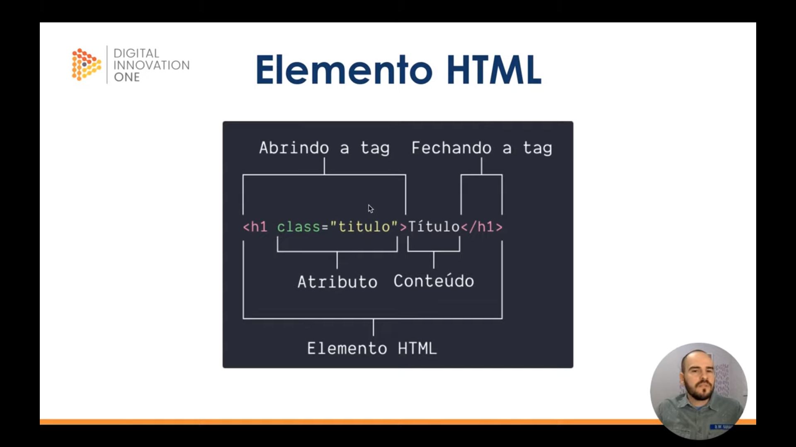
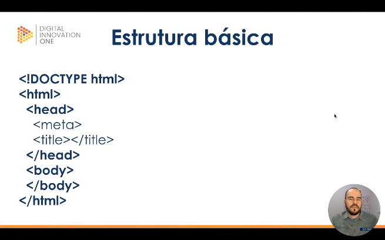

# Introdução ao curso de HTML
## Etrutura básica
### Objetivo
1. História e estrutura básica
2. Semãntica
3. Pricipais elementos HTML

### Requisitos
- Editor de texto
- Navegador de Internet

### Definição
Tim Berners-lee criador do html em 1991.

</img>

### Estrutura básica
```html
<!DOCTYPE html>
<html>
    <head>
        <meta>
        <title></title>
    </head>
    <body>
    </body>
</html>
```
</img>

[Back :back:](../README.md)
